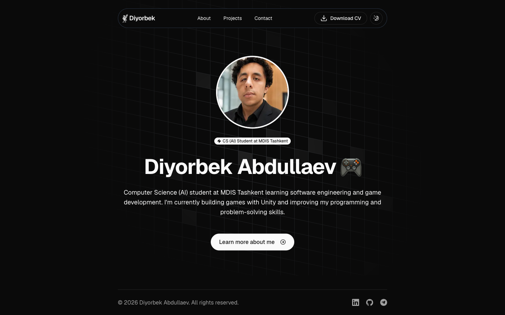

# My Portfolio Website


A modern personal portfolio website showcasing my background, projects, and journey as a Computer Science (AI) student and aspiring software engineer.

🌐 **Visit My Portfolio:** https://diyorbekabdullaevv.vercel.app/

<p align="center">
  
</p>

## About

This is my personal portfolio website, built to showcase my background, projects, skills, and journey in software development.

The portfolio serves as a central place for recruiters, developers, and collaborators to learn more about me and explore the projects I have built.

The website includes dedicated sections for my introduction, background, projects, resume, and professional social profiles.

## Features

- 🏠 Personal homepage with introduction
- 👨‍💻 About Me page with biography and photos
- 🚀 Projects showcase
- 📬 Contact form that delivers messages straight to Telegram
- 📄 Resume download
- 🌐 Social media and professional profile links
- 🌓 Dark / Light theme toggle
- 📱 Responsive design for desktop and mobile
- 🧭 Responsive navigation menu
- 🧭 Custom 404 and error pages
- 🎨 Modern and clean user interface

## Getting Started

```bash
pnpm install
cp .env.example .env.local   # add your Telegram bot token and chat id
pnpm dev
```

The site runs at http://localhost:3000.

The contact form needs `TELEGRAM_BOT_TOKEN` and `TELEGRAM_CHAT_ID` — see `.env.example` for how to get them. They must also be set in the Vercel project settings for the deployed site.

## Technologies

- Next.js
- React
- TypeScript
- Tailwind CSS
- shadcn/ui

## Technical Highlights

- Built a multi-page portfolio using Next.js
- Developed reusable React components
- Used TypeScript for type-safe development
- Styled the interface with Tailwind CSS
- Integrated reusable UI components with shadcn/ui
- Implemented responsive layouts for different screen sizes
- Added dark and light theme support
- Organized the project using reusable components and utility functions

---

⭐ If you enjoyed this project, consider giving it a star!
